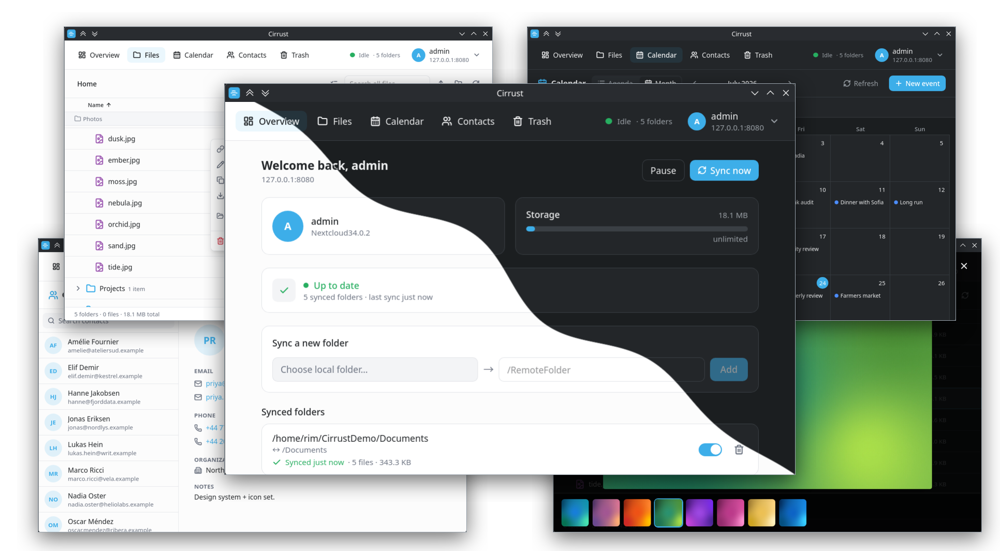

<p align="center">
  
</p>

<h1 align="center">Cirrust</h1>

A modern, lightweight **Linux desktop Nextcloud client** — files, **calendars**
and **contacts** — for compatible WebDAV / CalDAV / CardDAV servers. Built with
**Tauri v2 + Vue 3**, it runs on any desktop environment through standard
freedesktop interfaces (tray, keyring, notifications) and ships as a
self-contained **AppImage** and **Flatpak**. Optional native panel widgets are
provided for **KDE Plasma 6**, **GNOME** and **Cinnamon**; development happens on
Plasma, which is the most polished target but not a requirement.

> **Unofficial project.** Cirrust is not affiliated with, endorsed by, or
> sponsored by Nextcloud GmbH or KDE e.V. "Nextcloud" and "KDE" are trademarks
> of their respective owners; they are used here only to describe
> compatibility.

<p align="center">
  
</p>

## Features

- **Secure login** via Nextcloud **Login Flow v2** (app password stored in
  KWallet / Secret Service — never on disk).
- **File manager** over WebDAV — browse, search, download, **upload**
  (button + drag-and-drop from your desktop), **create folders**, **rename/move**,
  and multi-select bulk delete. An expandable-tree (Dolphin-style details) view
  with a **sticky location breadcrumb**, **type-ahead** jump (press a letter),
  **Ctrl/Cmd+F** to search, and a **right-click menu at the cursor** —
  including **Open in file manager** (reveal the synced copy) and, when you
  download an already-synced file, an offer to reveal it instead of re-fetching.
- **File preview** — images, video, PDFs and text/code in a modal. Images get
  a **gallery** with arrow-key navigation and a **thumbnail filmstrip**. **Video
  plays local-first** (from your synced copy when present, otherwise streamed)
  through a loopback HTTP media server so the timeline and **seeking** work on
  WebKitGTK, with **fullscreen** (`F` / double-click) and autoplay.
- **Public links** — create/copy/revoke Nextcloud share links (optional
  password + expiry) via the OCS Sharing API.
- **Folder sync** — register local↔remote folder pairs kept up to date by a
  custom Rust WebDAV sync engine (runs in the background via the tray).
- **Live sync observability** — see the current file, per-file and overall
  progress bars, transfer **speed**, files/bytes done vs. total, and a recent
  **activity feed** (uploads/downloads/deletions/conflicts/errors). Downloads
  stream with live byte progress; the top bar shows a live speed readout.
- **Sync controls** — global + per-folder pause/resume, ignore patterns
  (`*.tmp`, `node_modules`, …), and conflict resolution (keep mine / keep server).
- **Account overview** — storage quota/usage, account + server info, and the
  server-side activity feed (via the OCS API).
- **Trash bin** — list, restore, delete forever or empty Nextcloud's trash.
- **Calendar (CalDAV)** — **two-way** sync of your Nextcloud calendars.
  **Agenda** and **month** views, per-calendar colour filters, and create / edit /
  delete events (all-day or timed, location, notes). Cached on disk for instant
  offline load, reconciled in the background by CTag with a manual refresh.
- **Contacts (CardDAV)** — **two-way** sync of your address books. Searchable
  list + detail pane; create / edit / delete contacts with multiple emails and
  phone numbers, organization, title and notes. Edits are **lossless** — an
  iCalendar/vCard content-line codec preserves properties the UI doesn't model
  (recurrence rules, alarms, contact photos, custom `X-` fields), and writes are
  guarded by **ETags** (`If-Match`) so a concurrent change never clobbers.
- **Inline audio playback** — click an audio file to play it in the bottom
  **player bar**, which queues the folder's other tracks. Decoded through the
  **Web Audio API** for clean, gapless playback; synced files play from the
  local copy, the rest stream on demand. **Space** toggles play/pause anywhere.
- **Desktop notifications** on sync errors and new conflicts.
- **Autostart** — start on login minimized to the tray (toggle in Overview
  or the tray menu).
- **Light / dark / system theme** — a switch in **Overview → Appearance**
  (persisted); "System" follows the Plasma/OS colour scheme. Subtle animations
  with reduced-motion support. Icons by [Lucide](https://lucide.dev).
- **Plasma 6 widget** — shows live sync state in your panel.

## Installation

Cirrust ships three ways — an **AppImage** (most distros), a **Flatpak**
(sandboxed), or a **native build from source**. Grab the AppImage from the
GitHub **Releases** page; the Flatpak and native builds you produce yourself.
(No `.deb`/`.rpm` packages are provided.)

### AppImage — most distros, no installation

```bash
chmod +x Cirrust_*.AppImage
./Cirrust_*.AppImage
```

Self-contained (WebKitGTK and the GStreamer codecs are bundled). Notes:
- Needs a reasonably recent host — **glibc 2.41 or newer** (roughly Ubuntu 24.10+
  / Fedora 40+ / Arch). The bundle's WebKit has to be current enough to drive
  modern GPU drivers; on an older glibc, build from source or use the Flatpak.
- Some minimal distros lack `libfuse2`; either install it or run with
  `--appimage-extract-and-run`.
- Music and video play out of the box — the AppImage carries its own GStreamer
  plugins, so no codec packages are needed on the host.
- Optional: use a tool like *Gear Lever* or `appimaged` for menu integration.

### Flatpak (sandboxed)

```bash
cd app && npm run tauri build     # produces the bundle the manifest wraps
packaging/flatpak/build.sh        # builds + installs; needs flatpak-builder
flatpak run org.cirrust.client
```

### Native (build from source — any distro)

The best desktop integration. Install the
[Prerequisites](#prerequisites-manjaro--arch), then:

```bash
git clone https://github.com/rimseg/cirrust.git
cd cirrust/app
npm install
npm run tauri build               # binary → src-tauri/target/release/cirrust
```

Run it directly, or drop it on your `PATH`:

```bash
install -Dm755 src-tauri/target/release/cirrust ~/.local/bin/cirrust
# desktop entry + icon (KDE/GNOME/Cinnamon menu integration):
packaging/install-dev-desktop.sh
```

On Arch / Manjaro this is the recommended route.

### Uninstall

For a native install, `packaging/uninstall.sh` removes the binary, desktop entry,
autostart entry and icons (and refreshes the desktop/icon caches):

```bash
packaging/uninstall.sh           # remove the app, keep settings & data
packaging/uninstall.sh --purge   # also remove config, cache, sync/PIM data & the keyring password
```

Synced *file* folders on disk are never touched. AppImage/Flatpak installs are
removed the way you added them (delete the `.AppImage`, or
`flatpak uninstall org.cirrust.client`). Panel widgets are separate — the script
prints the exact removal command for KDE/GNOME/Cinnamon.

### Desktop-environment integrations

The app itself runs on any desktop (GTK + freedesktop standards: tray via
StatusNotifier, Secret Service keyring, XDG autostart/notifications). Panel
status widgets are provided per environment — all speak to the same D-Bus
service (`org.cirrust.client.Daemon`):

| Environment | Integration |
|---|---|
| **KDE Plasma 6** | `cd widget && kpackagetool6 --type Plasma/Applet --install package` |
| **GNOME** | `cp -r integrations/gnome-shell/cirrust@cirrust.app ~/.local/share/gnome-shell/extensions/` then enable in the Extensions app (log out/in first). Tray icon additionally needs the AppIndicator extension. |
| **Cinnamon** | `cp -r integrations/cinnamon/cirrust@cirrust.app ~/.local/share/cinnamon/applets/` then add via panel → Applets |
| **XFCE / MATE / Budgie / LXQt** | no extra piece needed — the status-badged tray icon covers it |
| **sway / hyprland / i3** | use a bar with a StatusNotifier tray module (e.g. waybar) |

## Architecture

```
┌──────────────────────────────────────────────┐        ┌──────────────────┐
│  app/  (Tauri v2 desktop app)                │        │ widget/          │
│                                              │        │ Plasma 6 plasmoid│
│  ┌────────────┐   invoke/   ┌─────────────┐  │ D-Bus  │ (QML)            │
│  │ Vue 3 + TS │ ──────────► │ Rust backend│◄─┼────────┤ sync status +    │
│  │ Tailwind v4│ ◄────────── │             │  │        │ "sync now"       │
│  └────────────┘   events    │ auth·webdav │  │        └──────────────────┘
│   file browser              │ sync · pim  │  │
│   cal·contacts              └──────┬──────┘  │
│                                    │ WebDAV  │
└────────────────────────────────────┼─────────┘
                                     ▼
                            Nextcloud server
```

- **Frontend** (`app/src`): Vue 3, Pinia stores, Vue Router, Tailwind v4.
  All backend calls go through the typed layer in `app/src/api`.
- **Backend** (`app/src-tauri/src`): Rust. Key modules —
  - `auth.rs` — Login Flow v2 + keyring credential storage
  - `webdav.rs` — WebDAV client (PROPFIND/GET/PUT/COPY/MOVE/DELETE/MKCOL,
    ranged GET, OCS helpers)
  - `sync/` — bidirectional engine, journal, watcher, progress, D-Bus service
  - `pim/` — **CalDAV/CardDAV** (calendars, events, address books, contacts):
    a lossless iCal/vCard content-line codec, generic DAV verbs, per-account
    JSON cache, two-way create/update/delete
  - `media.rs` — local-first media resolution (synced copy → cache download)
  - `mediahttp.rs` — loopback `http://127.0.0.1` media server that gives
    `<video>` a real, seekable HTTP origin (WebKitGTK can't seek custom schemes)
  - `stream.rs` — Range-capable `stream://` protocol for image/PDF previews
  - `sharing.rs` / `trash.rs` / `dashboard.rs` — OCS shares, trashbin, quota
  - `state.rs` / `config.rs` — session + persistent config
- The app keeps running in the **system tray** so background sync continues
  after the window is closed.

## Prerequisites (Manjaro / Arch)

```bash
# Rust toolchain (required to build the backend)
curl --proto '=https' --tlsv1.2 -sSf https://sh.rustup.rs | sh

# Tauri / WebKitGTK build + runtime deps
sudo pacman -S --needed webkit2gtk-4.1 base-devel curl wget file \
  openssl appmenu-gtk-module librsvg

# System-tray backend (REQUIRED — the app panics at startup without it:
#   "Failed to load ayatana-appindicator3 ... libayatana-appindicator3.so.1")
sudo pacman -S --needed libayatana-appindicator

# Audio/video codecs (WebKitGTK plays media through GStreamer)
sudo pacman -S --needed gst-plugins-good gst-plugins-bad gst-plugins-ugly gst-libav

# Only to build an AppImage: the bundler copies these codecs into the bundle
# and shells out to patchelf, failing without it.
sudo pacman -S --needed patchelf

# KWallet Secret Service (for credential storage) is part of Plasma already.
```

Node 20 or newer and npm are also required (CI builds on Node 22).

## Running

```bash
cd app
npm install
npm run tauri dev      # dev build with hot reload
npm run tauri build    # production build (AppImage + internal .deb)
```

## Building release bundles

```bash
cd app && NO_STRIP=1 npm run tauri build
```

produces the bundles under `app/src-tauri/target/release/bundle/`: the
**AppImage** (the universal, shipped artifact) and a **.deb** that is used
**only** as the input the Flatpak manifest wraps (`packaging/flatpak/build.sh`)
— it isn't published as a package. `.rpm` is not built. Configure targets in
`app/src-tauri/tauri.conf.json` (`bundle.targets`).

> `NO_STRIP=1` is required on rolling-release distros: linuxdeploy's bundled
> `strip` cannot handle modern `.relr.dyn` ELF sections and the AppImage
> bundling fails without it.

The AppImage bundles GStreamer (`bundle.linux.appimage.bundleMediaFramework`),
copying the codec plugins from the build machine — so they must be installed
locally or media playback silently ends up missing from the bundle. On Arch /
Manjaro the plugin helper directory is not where the bundler expects it, so
pass `GSTREAMER_HELPERS_DIR=/usr/lib/gstreamer-1.0`; Debian/Ubuntu needs no
override.

The GitHub Actions workflow in `.github/workflows/release.yml` builds and
attaches the **AppImage** to a draft release on every `v*` tag push.

### Building with Docker (no local toolchain needed)

If you don't want Rust/Node/WebKitGTK on your machine, build inside a
container — works from any distro:

```bash
DOCKER_UID=$(id -u) DOCKER_GID=$(id -g) docker compose run --rm build
# → bundles appear in ./dist/bundle/ (AppImage + the Flatpak-input .deb)
```

The image (see `packaging/docker/Dockerfile.build`) tracks the same Ubuntu base
as CI. AppImages inherit the build system's glibc *and* WebKit, and a base too
old to drive current GPU drivers leaves the window blank — so the base is kept
recent enough to render, at the cost of requiring a fairly recent host to run
the result. Cargo and npm caches persist in named volumes, so rebuilds are
incremental.

> Note: Docker is only used to **build**. The app itself is a desktop-session
> program (tray, session D-Bus, KWallet, audio) and is not meant to run in a
> container — install the resulting bundle instead.

## Security

- Credentials: only the Login Flow v2 **app password** is stored, in the OS
  keyring (KWallet/Secret Service) — never in config files or logs.
- A strict **CSP** is enforced in the webview; no `v-html`/`eval` in the
  frontend; Tauri capabilities are limited to the plugins actually used.
- The `stream://` protocol only proxies WebDAV requests with the logged-in
  user's own credentials (no privilege beyond the UI itself).
- TLS trusts the **system certificate store** (`rustls-tls-native-roots`).

### Verified against a live Nextcloud

The client is tested end-to-end against a real Nextcloud server. The `live_*`
tests are `#[ignore]` by default (they need a reachable server) and cover:

- **WebDAV** round-trip incl. rename (`live_roundtrip`), ranged GET
  (`live_range`), OCS quota/status (`live_ocs_user`), share create/list/revoke
  (`live_share`), trash delete→restore (`live_trash_roundtrip`).
- **Sync engine**, the full reconcile matrix: bidirectional file
  create/modify/delete with deletion propagation + idempotency
  (`live_sync_bidirectional`), one-sided edits both directions
  (`live_file_modify`), and **conflicts** — diverging edits of different sizes
  (`live_file_conflict_diff_size`), diverging edits of the *same* size that must
  still conflict rather than silently adopt (`live_file_conflict_same_size`),
  same-size identical content that *is* adopted (`live_file_same_size_identical_adopted`),
  delete-vs-modify where the surviving edit wins (`live_delete_vs_modify`), and
  pairing a folder that already holds identical content on both sides
  (`live_first_sync_preexisting_identical`). Directories: empty create/delete both
  ways (`live_dir_empty`), **deleting a directory that held files**
  (`live_dir_nonempty_delete`), a locally-deleted folder that gained a file
  remotely being preserved (`live_dir_preserve_remote_addition`), nested-tree
  deletion (`live_dir_nested_delete`), and ignore patterns (`live_ignore_patterns`).
- **CalDAV / CardDAV**: create → read-back (custom `X-` properties preserved) →
  ETag-guarded update → delete, with a stale-`If-Match` write correctly rejected
  as a 412 so a concurrent change can't be clobbered (`live_caldav_crud`,
  `live_carddav_crud`).

The runner starts the throwaway server on SQLite and runs the suite serially
(`--test-threads=1`), since SQLite is single-writer; a real Nextcloud on
MySQL/Postgres has no such limit.

**Before tagging a release, run the whole suite green.** The runner spins up a
throwaway Nextcloud in Docker, runs the `live_*` tests and tears it down:

```bash
packaging/live-tests.sh          # up, test, down
packaging/live-tests.sh --keep   # leave the container up afterwards
```

Or point the tests at your own server:

```bash
cd app/src-tauri
NC_URL=https://your.server NC_USER=you NC_PASS=app-password \
  cargo test live_ -- --ignored --nocapture
```

> **TLS note:** the client trusts the **system certificate store**
> (`rustls-tls-native-roots`), so self-hosted servers with an internal/company
> CA validate correctly (as long as that CA is installed system-wide, like
> `curl` uses).

### Plasma widget ↔ app

The backend serves a session D-Bus interface `org.cirrust.client.Sync` at
`/Sync` (`Status()`, `SyncNow()`, `Open()`). The widget polls `Status()` and
calls the others via `gdbus` (through a Plasma executable DataSource). Try it
while the app is running:

```bash
gdbus call --session --dest org.cirrust.client.Daemon \
  --object-path /Sync --method org.cirrust.client.Sync.Status
```

### Sync engine

A journaled, **bidirectional** engine (`src-tauri/src/sync/`):

- Three-way diff (remote ETag vs. local size/mtime vs. a per-folder **journal**)
  classifies each path as upload / download / delete-local / delete-remote /
  conflict. Deletions propagate both ways.
- **Conflicts** (both sides changed) keep the local edit as
  `name (conflicted copy DATE).ext` and take the server's version — matching the
  official client.
- Runs on startup, every 60s, on demand (`sync_now` / tray / widget), and
  reacts to local changes via an **inotify** watcher (`notify` crate, debounced).
- Live `SyncStatus` is pushed to the UI (`sync://status` event) and to the
  Plasma widget over D-Bus.
- Runs in the background via the tray after the window is closed.

Files that exist with **identical content on both sides** (e.g. on the first
sync of a folder that already lives on both ends) are adopted silently — only
genuinely diverging content produces a conflict.

Directory deletions propagate in both directions whether the folder was empty or
still held files; a folder is only removed once it is actually empty, so a file
added on the far side after you deleted the folder locally is preserved rather
than swept away. (Covered by the `live_dir_*` tests.)

See `docs/ARCHITECTURE.md` for the command surface and design notes.
